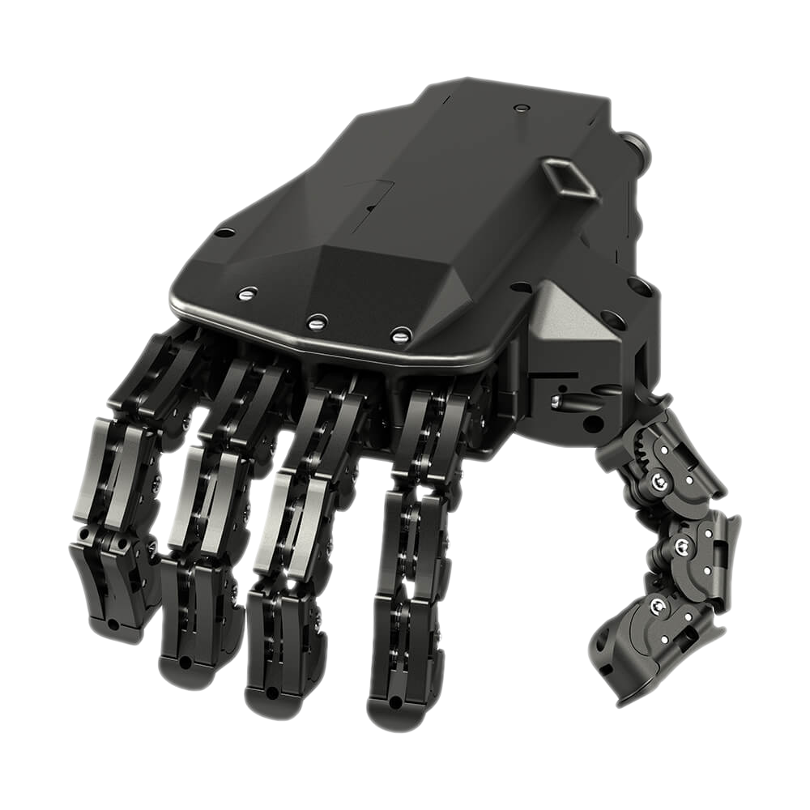
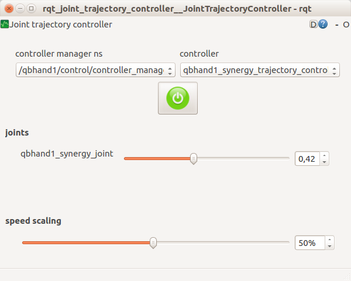
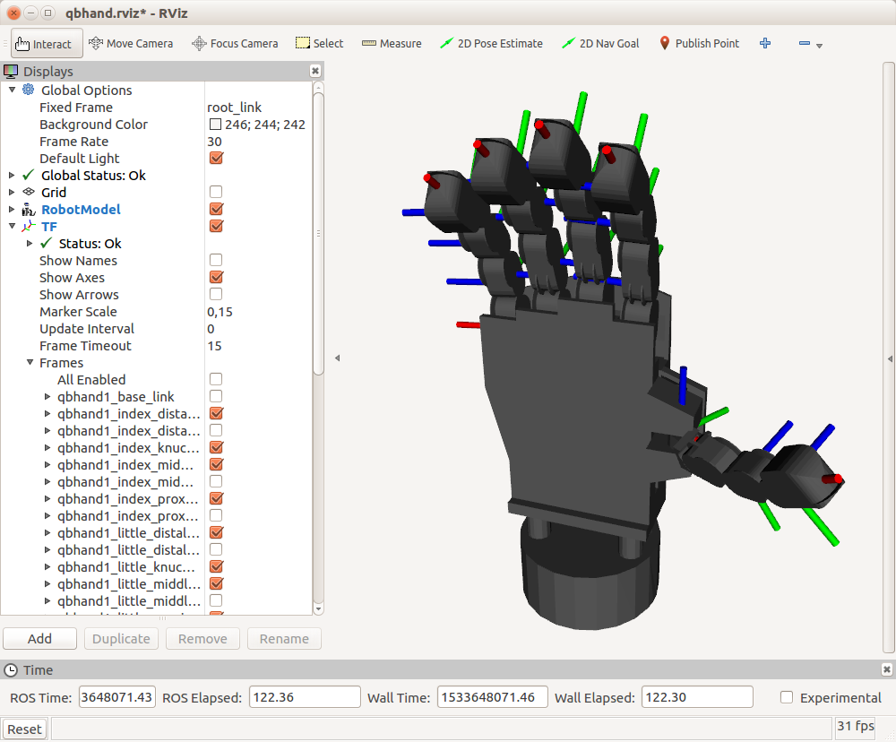

This is the ufficial _qbrobotics_ ROS2 package for the devices _qb SoftHand_ (device_type *qbhand*) and _qb SoftHand 2 Motors_ (device_type *qbhand2m*).

[_qb SoftHand_](https://www.qbrobotics.com/products/qb-softhand-research/) is an **adaptable yet robust robotic hand** gripper for collaborative robotic arms and for humanoid robots. It is in scale 1:1 with the average human hand and it is similarily composed by 19 completely desensorized phalanges and a flat palm.

The specific system of tendons connected to just a single motor provides the mechanical adaptability of the grasp to the shape and softness of any object without damaging it, i.e. exploiting the intrinsic capability of soft robots to continuously deform in a huge variety of possible configurations through interaction with external items.

In addition, the single actuator fixed directly on the back of the hand barely affects the total encumbrance and weight (only 480 grams) of the device.

[_qb SoftHand 2 Motors_](https://www.qbrobotics.com/products/qb-softhand-2-research/) is a device that offers a wider range of flexibility thanks a the second motor. Playing with two synergies, the _qbhand2m_ can perform a precise grasp to accurately interact with little objects.The higher strength of this device allows you to exploit the best from your robot, ensuring a firmer grip on the object. In addition to the great adaptability, the _qbhand2m_  capabilities allow it to apply localized contact forces, very useful feature for operating on interfaces commonly used in everyday life.




## Table of Contents
1. [Installation](#markdown-header-installation)
   1. [Requirements](#markdown-header-requirements)
   1. [Binaries](#markdown-header-ubuntu-packages)
   1. [Sources](#markdown-header-sources)
   1. [Device Setup](#markdown-header-device-setup)
1. [Usage](#markdown-header-usage)
   1. [Control](#markdown-header-control)
   1. [Control Modes](#markdown-header-control-modes)
         1. [GUI Control](#markdown-header-1.-gui-control)
         1. [Waypoint Control](#markdown-header-2.-waypoint-control)
         1. [API Control](#markdown-header-3.-api-control)
1. [Demo Applications](#markdown-header-demo-applications)
1. [Support, Bugs and Contribution](#markdown-header-support)
1. [Purchase](#markdown-header-purchase)
1. [Roadmap](#markdown-header-roadmap)

## Installation
### Requirements
If you have never set it up, you probably need to add your linux user to the `dialout` group to grant right access to the serial port resources. To do so, just open a terminal and execute the following command:
```
sudo gpasswd -a <user_name> dialout
```
where you need to replace the `<user_name>` with your current linux username.

_Note: don't forget to logout or reboot._

### Binaries
>_[APT INSTALLATION IS NOT YET AVAILABLE, COMING SOON! SKIP TO SOURCES...]_

If you prefer to leave your colcon workspace as it is, you can simply install all the ROS packages from the Ubuntu official repositories:
```
sudo apt update
sudo apt install ros-humble-qb-hand
```

### Sources
>Since you are interested in the ROS interfaces for our devices, it is assumed that you are familiar at least with the very basics of the ROS environment. If not, it might be useful to spend some of your time with [ROS2](https://docs.ros.org/en/humble/Tutorials.html) and [colcon](https://docs.ros.org/en/humble/Tutorials/Beginner-Client-Libraries/Colcon-Tutorial.html) tutorials. After that, don't forget to come back here and start having fun with our Nodes.

Install the _qb SoftHand_ packages for a ROS user is straightforward. Nonetheless the following are the detailed steps which should be easy to understand even for ROS beginners:

1. Clone both the `qb_device` and `qb_hand` packages to your colcon Workspace, e.g. `~/colcon_ws`:
   ```
   cd `~/colcon_ws/src`
   git clone --recurse-submodules https://bitbucket.org/qbrobotics/qbdevice-ros.git
   cd qbdevice-ros
   git checkout production-humble
   git submodule update --init --recursive
   cd ..
   git clone https://bitbucket.org/qbrobotics/qbhand-ros.git
   cd qbhand-ros
   git checkout production-humble
   ```

1. Compile the packages using `colcon`:
   ```
   cd `~/colcon_ws`
   colcon build
   ```
   **Note:** depending on your ROS installation, you may need some extra packages to properly compile the code. You can install ROS dependencies using `rosdep`:
   ```
   cd `~/colcon_ws`
   rosdep install --from-paths src --ignore-src -r -y
   ```

1. If you were not familiar with ROS you should be happy now: everything is done! Nonetheless, if you encounter some troubles during the compilation, feel free to ask for support on [our Bitbucket](https://bitbucket.org/account/user/qbrobotics/projects/ROS).

### Device Setup
Connect a _qb SoftHand_ to your system is basically a matter of plugging in a USB cable. Nonetheless, **read carefully** the [manual](https://www.qbrobotics.com/products/qb-softhand-research/) to understand all the requirements and advices about either single-device or chained configurations.

## Usage

### Control
The control Node exploits the [ros2_control](https://control.ros.org/master/index.html) Controller Manager which loads and runs the device controllers. Each controller provides a Server that, together with the Hardware Interface structure, allows the user to send commands to the relative device and get its measurements.

From an API point of view, it is implemented a client which matches the relative trajectory controller and provides a method to send Goals, i.e. command references, directly to the given device. Additionally the client is subscribed to a Topic (`*_controller/joint_trajectory`) that can be used to send reference commands from outside the code, e.g. asynchronously from the command line, or from a higher level control Node, e.g. as a result of a planning algorithm.

>It is recommended not to mix these two control modes: choose either to control the device directly from the code by extending our API or through this command Topic.

### Control Modes

Once the device is physically connected to your system, you can launch the device node with the following command line:
```
ros2 launch qb_hand_description [DEVICE LAUNCHER] standalone:=true activate_on_initialization:=true device_id:=[DEVICE ID]
```

Substitute [DEVICE LAUNCHER] with *bringup_qbhand.launch* if you are using _qb SoftHand_ or with *bringup_qbhand2m.launch* if you are using _qb SoftHand 2_.

Substitute [DEVICE ID] with the actual device id number.

###### The arguments explained
- `activate_on_initialization [false]`: Activates the motor at startup (the device will not move since the first command reference is received).
- `device_id [1]`: Each device has its own ID, you need to set the one of the actual device connect to your system. 
- `standalone [false]`: Starts the Communication Handler together with the control Node. If you set this to `false` (or remove it since the default value is `false`), you need to launch the Communication Handler in a separate terminal.

It is worth noting that the activation of the motor can be postponed to improved safety if you are not aware of the state of the system at startup. To do so just set `activate_on_initialization:=false` (or remove it since the default value is `false`) and make a call to the Communication Handler `activate_motors` Service, when your system is ready, e.g. as follows:
```
ros2 service call /communication_handler/activate_motors {"id: <actual_device_id>, max_repeats: 0"}
```

###### Additional arguments
- `get_currents [true]`: Choose whether or not to retrieve current measurements from the device.
- `get_positions [true]`: Choose whether or not to retrieve position measurements from the device.
- `get_distinct_packages [true]`: Choose whether or not to retrieve current and position measurements from the device in two distinct packages.
- `max_repeats [3]`: The maximum number of consecutive repetitions to mark retrieved data as corrupted.
- `use_rviz [false]`: Choose whether or not to use rviz. If enabled you should see a virtual hand on screen performing a similar behavior.
- `use_gui [false]`: Choose whether or not to use `rqt_joint_trajectory_controller` gui to test command for device.

   >Be aware that the _qb SoftHand_ is desensorized and therefore it is not possible to know exactly the position of each finger: the screen visualization is just the result of an estimation of the closure value and may differ from the real configuration of your _qb SoftHand_ (e.g. when grasping an object).

The followings are particular control modes which are enabled with few parameters, but the concepts of this paragraph hold for all of them.

#### 1. GUI Control
This control mode is the one suggested to test that everything is working as expected. You are able to open and close the _qb SoftHand_ interactively, but nothing more than this.

>You will probably need this only the very first times and for debugging.

To start this mode just add `use_gui:=true` to the general `ros2 launch` command.

After a while a GUI should appear to screen with two empty dropdown menus, a red enable button below them, and a _speed scaling_ slider at the bottom.
1. Select the _Controller Manager_ namespace from the left menu, e.g. `/<robot_namespace>/controller_manager` (where `<robot_namespace>` is an additional argument of the launch file needed with several devices). This enables the right menu which provides all the controllers available for the connected device.
1. Select the _qb SoftHand_ controller from the second dropdown menu and enable it through the circular button.
1. A single slider will appear in the GUI to control the closure of the hand, which ranges from `0` (hand completely open) to `1` (hand completely closed). Move the slider to perform a complete grasp or to partially open/close the _qb SoftHand_. You can also vary the speed through the bottom _speed scaling_ slider if you like a faster/slower motion. No other timing constraints can be set in this mode.
>**Known Issue**: You will notice that this "rqt_gui method" is a little bit bugged: when the circular button is green the trajectories are are continuously sent-started-and-stopped to ros2_control... so if you want to see the real trajectory execution you have to press the circular button again, turning it red. We are investigating if this is a bug of `rqt_joint_trajectory_controller` or not. We hope to solve this issue soon.



#### 2. Waypoint Control
This control mode is a bit more structured and useful than the previous: it allows to set a fixed trajectory of any number of position waypoints (with timing constraints) and set the robot to cycle infinitely on it (because of the loop it is recommended to set the first and last waypoint in a similar configuration to avoid unwanted sudden changes).

 You won't see any control interface in this case but the _qb SoftHand_ should start moving according to the given trajectory, parsed from a yaml file located at
```
qb_hand_ros2_control/config/<device_type>_waypoints.yaml
```

where `device_type` is _qbhand_ or _qbhand2m_.

After the execution of the bringup device launcher command, in another terminal run:
```
ros2 launch qb_hand_ros2_control [DEVICE LAUNCHER] device_id:=[DEVICE ID]
```

Substitute [DEVICE LAUNCHER] with *qbhand_waypoints_publisher.launch.py* if you are using _qb SoftHand_ or with *qbhand2m_waypoints_publisher.launch* if you are using _qb SoftHand 2_.

Substitute [DEVICE ID] with the actual device id number.

##### Customization
You can modify the waypoint trajectory to replicate the behavior you want, just modify the yaml file adding more goals to `goal_names`, modifying `positions` or changing time of execution between waypoints.

#### 3. API Control
If you need a complex (i.e. real) control application, e.g. the _qb SoftHand_ is mounted on a robot which uses computer vision aid to grasp objects, the previous two control modes don't really help much. What we provide for real applications is the full ROS libraries to manage and control the _qb SoftHand_.

You have to dig into the [qb_hand](http://wiki.ros.org/qb_hand) package documentation and find what better suits for your needs, e.g. extend the `qbDeviceControl` class provided, or even redesign some of its parts by following an approach similar to ours.

>Our recommendation is to use as much as possible our resources, classes and macros to help you while developing your application. Don't reinvent the wheel!

At last, if you come up with a something useful for the whole community, it will be amazing if you propose your improvement with a Pull Request in the package of interest on [our Bitbucket](https://bitbucket.org/account/user/qbrobotics/projects/ROS).

## Demo Applications


## Support, Bugs and Contribution
Since we are not only focused on this project it might happen that you encounter some trouble once in a while. Maybe we have just forget to think about your specific use case or we have not seen a terrible bug inside our code. In such a case, we are really sorry for the inconvenience and we will provide any support you need.

To help you in the best way we can, we are asking you to do the most suitable of the following steps:

1. It is the first time you are holding a _qb SoftHand_, or the first time you are using ROS, or even both: it is always a pleasure for us to solve your problems, but please consider first to read again the instructions above and the ROS tutorials. If you have ROS related questions the right place to ask is [ROS Answers](http://answers.ros.org/questions/).
1. You are a beginner user stuck on something you completely don't know how to solve or you are experiencing unexpected behaviour: feel free to contact us at [support+ros at qbrobotics.com](support+ros@qbrobotics.com), you will receive the specific support you need as fast as we can handle it.
1. You are quite an expert user, everything has always worked fine, but now you have founded something strange and you don't know how to fix it: we will be glad if you open an Issue in the package of interest on [our Bitbucket](https://bitbucket.org/account/user/qbrobotics/projects/ROS).
1. You are definitely an expert user, you have found a bug in our code and you have also correct it: it will be amazing if you open a Pull Request in the package of interest on [our Bitbucket](https://bitbucket.org/account/user/qbrobotics/projects/ROS); we will merge it as soon as possible.
1. You are comfortable with _qbrobotics®_ products but you are wondering whether is possible to add some additional software features: feel free to open respectively an Issue or a Pull Request in the package of interest on [our Bitbucket](https://bitbucket.org/account/user/qbrobotics/projects/ROS), according to whether it is just an idea or you have already provided your solution.

In any case, thank you for using [_qbrobotics®_](https://www.qbrobotics.com) solutions.

## Purchase
If you have just found out our company and you are interested in our products, come to [visit us](https://www.qbrobotics.com) and feel free to ask for a quote.

## Roadmap
Features to be implemented in the future:

- Improve stability
- CI an tests
- Gazebo simulation
- Improved controller to better replicate the real grasp